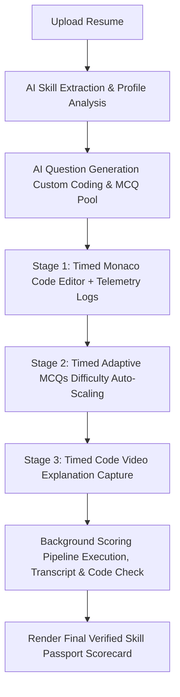

# Skill Passport Assessment Platform — System Structure & Components

This document details the core structure, flow, and components of the **Skill Passport Assessment Platform**.

---

## 🛠️ System Structure & Assessment Flow

The platform operates as a timed, multi-stage assessment pipeline designed to dynamically evaluate a candidate's technical skills based on an uploaded resume, without requiring accounts or registration.

---

## 🧩 Core Components & Their Use

Here is the breakdown of the primary components used in the assessment lifecycle and their specific purpose:

### 1. `ResumeUpload` (Entry Stage)
*   **Purpose:** Provides a visual drag-and-drop dropzone for PDF resumes.
*   **Use:** Parses the PDF text contents locally, triggers an AI call to extract name, primary focus, and overall skill list, and lets the candidate verify their profile details before initiating the assessment.

### 2. `CodeEditor` (Stage 1: Live Coding)
*   **Purpose:** Renders a fully interactive development environment.
*   **Use:** Integrates Monaco Editor loaded with the AI-tailored coding challenge, boilerplate function signature, and description. Candidates can write their solutions and click "Run Tests" to execute their code against visible tests.

### 3. `KeystrokeLogger` (Integrity Monitoring)
*   **Purpose:** Monitors testing environment integrity in the background.
*   **Use:** Tracks candidate keystrokes, counts copy/paste events, and logs window blur events (tab switches or focus losses) during the coding session to check for potential plagiarism.

### 4. `AdaptiveMCQ` (Stage 2: Adaptive Questions)
*   **Purpose:** Houses the adaptive multiple-choice question engine.
*   **Use:** Serves 5 questions sequentially from the generated pool. It scales the difficulty of the next question up or down based on whether the candidate answered the previous question correctly.

### 5. `VideoRecorder` (Stage 3: Video Pitch)
*   **Purpose:** Captures the candidate's oral explanation of their code.
*   **Use:** Configures HTML5 MediaRecorder to capture audio and video from the camera. The candidate records a short (90-second) walkthrough explaining their algorithm, time/space complexity, and implementation choices.

### 6. `ProcessingScreen` (Pipeline Wait State)
*   **Purpose:** Displays pipeline execution logs while scoring runs.
*   **Use:** Polls the server status while background workers compile the candidate's code in Judge0, transcribe the video via Whisper, verify the transcript matches the code, and calculate final composite scores.

### 7. `SkillPassportCard` (Final Scorecard)
*   **Purpose:** Renders the final, verified competency certificate.
*   **Use:** Displays an overall score ring gauge, breakdown scores (Coding, MCQs, Explanation, Resume suitability), trust confidence indicators, anomaly warning logs, and a tabbed evidence viewer showing the raw code submitted and the recorded video pitch.
